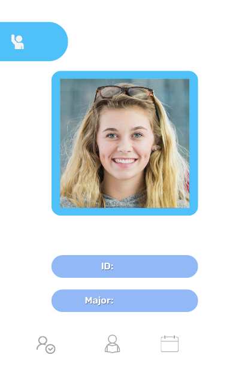

# Face Recognition Attendance System

A real-time face recognition attendance system built with Python, OpenCV, and Firebase that automatically tracks student attendance using facial recognition technology.

## Features

- **Real-time Face Detection**: Live webcam feed with face detection and recognition
- **Automatic Attendance Tracking**: Automatically marks attendance when a registered face is detected
- **Firebase Integration**: Cloud database storage for student information and attendance records
- **Interactive UI**: Custom graphical interface showing student information and attendance status
- **Anti-duplicate System**: Prevents multiple attendance entries for the same student in a short time period
- **Student Image Display**: Shows student photos alongside their information
<p align="center">
  
  
</p>
## Prerequisites

Before running this project, make sure you have:

- Python 3.7+
- A webcam connected to your computer
- Firebase project with Realtime Database
- Firebase service account key

## Installation

1. **Clone the repository**
   ```bash
   git clone https://github.com/yourusername/face-recognition-attendance.git
   cd face-recognition-attendance
   ```

2. **Install required packages**
   ```bash
   pip install opencv-python
   pip install face-recognition
   pip install cvzone
   pip install firebase-admin
   pip install numpy
   pip install pickle-mixin
   ```

3. **Set up Firebase**
   - Create a Firebase project at [Firebase Console](https://console.firebase.google.com/)
   - Enable Realtime Database
   - Generate a service account key and download the JSON file
   - Rename it to `serviceAccountKey.json` and place it in the project root

4. **Create required directories**
   ```bash
   mkdir Images
   mkdir Resources
   mkdir Resources/Modes
   ```

## Project Structure

```
face-recognition-attendance/
│
├── main.py                 # Main application file
├── AddDataToDatabase.py    # Script to add student data to Firebase
├── EncodeGenerator.py      # Generate face encodings for students
├── serviceAccountKey.json  # Firebase service account key (not included)
├── EncodeFile.p           # Pickle file containing face encodings
│
├── Images/                # Student photos (ID.png format)
│   ├── 321654.png
│   ├── 852741.png
│   └── ...
│
└── Resources/
    ├── background.png     # Main UI background image
    └── Modes/            # UI mode images
        ├── 1.png         # Active mode
        ├── 2.png         # Marked mode
        └── 3.png         # Already marked mode
```

## Setup Instructions

### 1. Configure Firebase

Update the database URL in all Python files:
```python
firebase_admin.initialize_app(cred, {
    'databaseURL': 'https://your-project-id-default-rtdb.firebaseio.com/'
})
```

### 2. Add Student Data

Edit `AddDataToDatabase.py` with your student information:
```python
data = {
    'student_id': {
        'name': 'Student Name',
        'major': 'Student Major',
        'starting_year': 2022,
        'total_attendance': 0,
        'standing': 'G',  # G = Good, B = Bad, etc.
        'year': 1,
        'last_attendance_time': '2022-12-11 00:54:34'
    }
}
```

Run the script:
```bash
python AddDataToDatabase.py
```

### 3. Add Student Images

- Place student photos in the `Images/` folder
- Name format: `{student_id}.png` (e.g., `321654.png`)
- Recommended image size: 216x216 pixels
- Ensure clear face visibility for better recognition

### 4. Generate Face Encodings

```bash
python EncodeGenerator.py
```

This will create `EncodeFile.p` containing the face encodings for all student images.

### 5. Prepare UI Resources

Create or download the following images:
- `Resources/background.png` - Main UI background
- `Resources/Modes/1.png` - Active recognition mode
- `Resources/Modes/2.png` - Attendance marked mode
- `Resources/Modes/3.png` - Already marked mode

## Usage

1. **Run the main application**
   ```bash
   python main.py
   ```

2. **Using the System**
   - The webcam feed will start automatically
   - Position yourself in front of the camera
   - The system will detect and recognize registered faces
   - Attendance will be marked automatically
   - Student information will display on the right panel
   - Press 'q' to quit the application

## Key Features Explained

### Face Recognition
- Uses the `face_recognition` library for accurate facial recognition
- Implements distance threshold (0.50) for better accuracy
- Real-time processing of webcam feed

### Attendance Management
- Automatic attendance marking with timestamp
- Prevents duplicate entries with cooldown system
- Updates total attendance count in Firebase

### User Interface
- Custom background with mode indicators
- Real-time display of student information
- Visual feedback for recognition status

## Configuration Options

### Recognition Sensitivity
Adjust the face distance threshold in `main.py`:
```python
if matches[matchIndex] and faceDis[matchIndex] < 0.50:  # Lower = more strict
```

### Cooldown Period
Modify the recognition cooldown:
```python
recognitionCooldown = 30  # frames (30 frames ≈ 1 second at 30fps)
```

### Camera Settings
Change camera resolution:
```python
cap.set(3, 640)  # Width
cap.set(4, 480)  # Height
```

## Troubleshooting

### Common Issues

1. **"No module named 'face_recognition'"**
   ```bash
   pip install face-recognition
   # On Windows, you might need:
   pip install cmake
   pip install dlib
   ```

2. **Firebase connection error**
   - Verify `serviceAccountKey.json` is in the correct location
   - Check database URL in the code
   - Ensure Firebase project has Realtime Database enabled

3. **Camera not working**
   - Try different camera indices: `cv2.VideoCapture(1)` or `cv2.VideoCapture(2)`
   - Check if camera is being used by another application

4. **Face not recognized**
   - Ensure student image is clear and well-lit
   - Regenerate encodings with `python EncodeGenerator.py`
   - Adjust recognition threshold

## Database Schema

Student data structure in Firebase:
```json
{
  "Students": {
    "student_id": {
      "name": "string",
      "major": "string",
      "starting_year": "number",
      "total_attendance": "number",
      "standing": "string",
      "year": "number",
      "last_attendance_time": "string"
    }
  }
}
```


## Acknowledgments

- OpenCV community for computer vision tools
- face_recognition library by Adam Geitgey
- Firebase for real-time database services
- CVZone for additional computer vision utilities


---

**Note**: This system is designed for educational and small-scale attendance tracking. For production use, consider additional security measures and privacy considerations.
